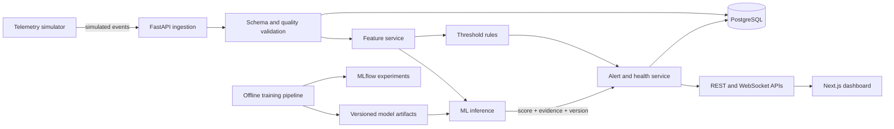

# DrivePulse AI

> Explainable vehicle health digital twin and predictive-maintenance platform.

DrivePulse AI is a four-month OJT/capstone project that turns simulated or public time-series telemetry into an understandable vehicle-health view. It is designed to validate and store sensor readings, detect abnormal behaviour, estimate maintenance risk, explain every alert with evidence, and present the results through driver, technician, fleet, and model-monitoring views.

The project is an engineering and machine-learning prototype—not a certified diagnostic or vehicle-safety system. It is independent, is not affiliated with any automotive manufacturer, and does not use proprietary vehicle data or branding.

## Project status

**Planning and initial scaffolding.** The repository currently defines the intended modules and CI workflows. Most application, training, simulator, and deployment files are placeholders and are being implemented in the build order described below. Setup and run commands will be finalized as each component becomes executable.

## Product goals

- Ingest and visualize telemetry for multiple simulated vehicles in near real time.
- Detect explicit threshold violations and unusual multivariate sensor patterns.
- Estimate the probability of a clearly defined maintenance or failure event when defensible labels are available.
- Explain every risk result using observed evidence, feature contributions, model version, and limitations.
- Compute a transparent 0–100 vehicle health score with component-level contributions.
- Support distinct driver, technician, fleet, and ML-engineering workflows.
- Provide reproducible training, automated tests, observability, Docker packaging, and deployment documentation.

## Core capabilities

| Capability | Planned implementation |
| --- | --- |
| Telemetry | Timestamped simulator events for speed, RPM, coolant temperature, battery voltage, engine load, and vibration |
| Validation | Pydantic schemas, unit/range checks, duplicate detection, and explicit data-quality status |
| Live updates | FastAPI REST endpoints and WebSockets, targeting under 3 seconds end-to-end in the demo environment |
| Known conditions | Documented deterministic threshold rules |
| Anomaly detection | Isolation Forest with deviation-from-baseline evidence |
| Failure risk | Logistic Regression baseline followed by Random Forest/XGBoost comparison and calibration |
| Explainability | SHAP or equivalent feature contributions plus safe, plain-language evidence |
| Health score | Documented 0–100 score with visible deductions and no hidden random factors |
| Alert workflow | New, acknowledged, resolved, and dismissed states with an audit trail |
| User experience | Fleet overview, vehicle cockpit, alert details, technician report, model monitor, and scenario lab |

## Architecture



The online path is separated from offline model training so ingestion, feature generation, inference, alerting, and presentation can be tested independently. Backend services access deployed models only through `ml/src/inference/predictor.py`.

See [docs/architecture.md](docs/architecture.md) for the evolving architecture documentation.

## Technology stack

- **Backend:** Python, FastAPI, Pydantic, SQLAlchemy, Alembic, PostgreSQL, WebSockets
- **ML and data:** Pandas, NumPy, scikit-learn, XGBoost, SHAP, MLflow
- **Frontend:** Next.js, React, TypeScript, Tailwind CSS, Recharts/ECharts
- **Engineering:** Docker Compose, Pytest, Ruff, GitHub Actions

## Data strategy

Development combines public predictive-maintenance benchmarks with an automotive telemetry simulator:

- **UCI AI4I 2020:** labelled predictive-maintenance experiments.
- **NASA C-MAPSS:** optional degradation/RUL experiments.
- **Synthetic automotive telemetry:** normal, degraded, and fault scenarios for anomaly evaluation and the live product demo.

AI4I and C-MAPSS are engineering benchmarks, not real automotive diagnostic datasets. Results trained on them will be presented as demonstrations of the modelling pipeline rather than claims of real-world vehicle diagnostic accuracy. Every generated telemetry event must be marked with `"source": "simulated"`.

Example telemetry contract:

```json
{
  "vehicle_id": "SIM-001",
  "timestamp": "2026-08-05T10:30:00Z",
  "speed_kmph": 62.0,
  "engine_rpm": 2250.0,
  "coolant_temp_c": 103.0,
  "battery_voltage": 11.7,
  "engine_load_pct": 76.0,
  "vibration_rms": 0.68,
  "fault_code": null,
  "scenario_label": "degraded",
  "source": "simulated"
}
```

Dataset provenance, licences, mappings, leakage controls, and quality rules will be maintained in [data/README.md](data/README.md).

## Repository structure

```text
DrivePulseAI/
├── backend/                 FastAPI application, schemas, persistence, and services
├── frontend/                Next.js dashboard and API/WebSocket clients
├── ml/                      Feature, training, evaluation, inference, and explanations
├── simulator/               Reproducible normal, degraded, and fault telemetry scenarios
├── data/                    Dataset documentation and ignored local data directories
├── docs/                    Architecture, API, model-card, and project documentation
├── scripts/                 Dataset, environment, and database helper scripts
├── .github/workflows/       Backend, frontend, and ML CI checks
├── docker-compose.yml       Integrated stack definition (planned)
└── .env.example             Environment-variable template (planned)
```

## Getting started

### Prerequisites

- Python 3.11 or newer (Python 3.12 is the target baseline)
- Node.js 20 or newer
- PostgreSQL 15 or newer
- Docker and Docker Compose for the integrated stack

### Current development setup

The repository is not yet runnable end to end because the component configuration and entry points are still being implemented. For work on the existing scaffold, create isolated environments and install dependencies as follows:

```bash
git clone https://github.com/direkkakkar319-ops/DrivePulseAI.git
cd DrivePulseAI

python3 -m venv .venv
source .venv/bin/activate
python -m pip install --upgrade pip
pip install -r requirements.txt

cd frontend
npm ci
```

Do not expect `docker compose up`, the API server, training commands, or the dashboard to work until their placeholder files are completed. This section will be replaced with verified one-command setup and run instructions during the telemetry/backend milestones.

## Intended API

| Method | Endpoint | Purpose |
| --- | --- | --- |
| `POST` | `/api/v1/telemetry` | Validate and ingest one or more telemetry events |
| `GET` | `/api/v1/vehicles` | List vehicles and current health summaries |
| `GET` | `/api/v1/vehicles/{id}/telemetry` | Query historical readings by field and time range |
| `GET` | `/api/v1/vehicles/{id}/health` | Return health score, contributions, and active risks |
| `GET` | `/api/v1/vehicles/{id}/alerts` | List alerts and supporting evidence |
| `PATCH` | `/api/v1/alerts/{id}` | Acknowledge, resolve, or dismiss an alert |
| `GET` | `/api/v1/models` | Return deployed model metadata and evaluation summaries |
| `WS` | `/ws/vehicles/{id}` | Stream telemetry, health, and alert updates |

## ML requirements

The initial modelling layers are:

1. Documented threshold rules for known operating conditions.
2. Isolation Forest for unsupervised anomaly detection.
3. Logistic Regression as the supervised baseline, followed by a justified Random Forest/XGBoost comparison.
4. Optional RUL regression only when the chosen dataset supports a defensible time-to-event target.

Failure classification reports precision, recall, F1, PR-AUC, confusion matrix, and probability calibration—not accuracy alone. Sequential data uses time-aware or group-aware splits, preprocessing is learned from training data only, and all feature pipelines are checked for future-label leakage.

Every displayed prediction must include:

- the score or probability and its timestamp;
- model and feature versions;
- contributing readings or features;
- an understandable explanation and known limitations.

The UI must describe model output as risk or inspection guidance, never as a certain diagnosis.

## Testing and quality targets

- Reject or quarantine all deliberately malformed telemetry with a reason.
- Keep 95% of normal local REST requests below 500 ms, excluding training.
- Show 95% of simulator events in the dashboard within 3 seconds in the demo environment.
- Include model version and at least one evidence field with every user-visible prediction.
- Reach at least 80% coverage for critical backend services and feature functions.
- Rebuild features, train, and evaluate from a clean environment with one documented command.
- Test validation, feature calculations, health scoring, alert behaviour, API/database integration, WebSockets, split integrity, schema parity, and critical frontend flows.

## Roadmap

| Phase | Weeks | Deliverable |
| --- | ---: | --- |
| Discovery and data | 1–3 | Approved scope, dataset decision, data dictionary, EDA, and quality rules |
| Telemetry foundation | 4–6 | Reproducible simulator, validated ingestion, persistence, history, and WebSockets |
| MVP | 7–8 | Fleet/cockpit dashboard, rule alerts, health score, and end-to-end demo |
| Explainable ML | 9–11 | Baselines, model comparison, calibration, error analysis, explanations, and model card |
| Product workflows | 12–13 | Alert lifecycle, technician/fleet views, reports, MLflow, and observability |
| Release | 14–16 | Docker, CI, testing, accessibility, deployment, documentation, demo, and final presentation |

## Safety, privacy, and limitations

- DrivePulse AI is decision-support software for education and demonstration.
- It does not issue vehicle-control commands or replace a qualified technician.
- Synthetic, benchmark, and any future consented readings must remain distinguishable by source.
- No personal driving data is required for the demo; vehicle IDs are synthetic.
- Optional OBD-II work requires a separate safety/privacy review and owner consent.
- Model limitations, imbalance, dataset mismatch, and known failure modes must be documented openly.

## Contributing

This project is currently developed as an OJT portfolio project. Before contributing, open an issue describing the proposed change and preserve the fixed technology choices, evidence-first prediction contract, and simulated-data labelling rules. Python code should be type hinted and pass Ruff/Pytest; frontend changes should keep TypeScript contracts synchronized with backend Pydantic schemas.

## Author

**Rudraksh Gupta** — B.Tech, Artificial Intelligence and Machine Learning

## Licence

A licence has not yet been selected. Until a valid licence file is added, the repository should not be treated as granting permission to copy, modify, or redistribute the project.
