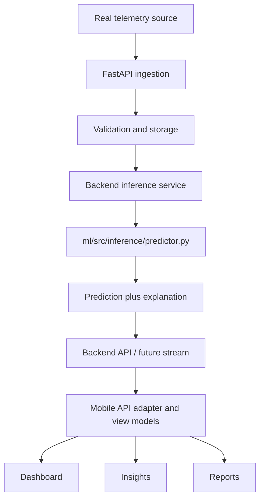

# Future mobile integration and product workflow

Status and integration boundaries for the DrivePulse AI mobile prototype. This is a roadmap, not a commitment to ship every feature.

## Implemented

- Android Firebase email/password signup, login, password reset, verification, session restoration and logout; Google sign-in when configured.
- Verified-account route protection. Web/iOS authentication is not configured.
- FastAPI Firebase token verification and PostgreSQL profile read/upsert. The signed-in layout automatically synchronizes the account; Account displays results and retry controls. Backend failure does not replace the Firebase session.
- ML dataset loading, preprocessing, feature engineering, and AI4I exploration. These are preparation utilities, not trained models.

## Demo / prototype

- Four signed-in tabs: Home, Vehicles, Insights, Account. Vehicle details, add/edit, sensor history, observation details and reports are nested routes.
- `mobile/src/api/vehicle-data-provider.ts` defines the replaceable provider boundary. `types/vehicle-health.ts` contains frontend view models, separate from provisional wire types in `types/index.ts`.
- `mobile/src/demo/fixtures.ts` is the only source of demo telemetry, assessment and observation content. `demo/provider.ts` provides isolated in-memory vehicle metadata and explicit scenario selection.
- Vehicle name is required; make/model/year/notes are optional prototype metadata. Metadata never determines readings. New vehicles have no readings until a scenario is selected.
- Data resets when the signed-in provider is remounted, including logout/account changes or app restart. There is no vehicle persistence or external metadata lookup.
- Scenario controls in Account demonstrate no data, waiting, collecting, unavailable assessment, missing readings, stale data, disconnection, failure and loading. The loading fixture stays pending until another scenario is chosen. A failed fixture remains failed on retry until its scenario changes.
- Demo playback is a fixed snapshot ending at `2026-09-28T18:00:00Z`, not a network stream. The timestamp is displayed honestly; no ticking “10 seconds ago” label is fabricated. The demo freshness flag describes the selected scenario, not the current wall clock.
- Sensor histories use deterministic samples. Charts, minima, maxima, averages, current readings, observation evidence and report periods share those samples. Zero speed is valid; null is unavailable. Charts break across missing samples and do not invent ranges.
- The 86/100 gauge is explicitly an authored illustrative assessment associated with voltage-deviation evidence, not a scoring formula or model output. No failure probability, confidence, RUL, physical diagnosis, or safety classification is invented.
- The report is a preview composed from that same snapshot. There is no generation API, PDF, share action, or historical report persistence.
- Generic vehicle artwork is decorative and is not selected from make/model information.

## Planned architecture

### ML boundary

The existing intended boundary is `backend/app/services/inference_service.py` → `ml/src/inference/predictor.py`. Repository instructions prohibit backend imports of individual model implementations. Keep ML in the Python library called by FastAPI unless later evidence justifies a separate service.

Model, training, explanation and inference files currently contain placeholders; the health-score file is empty. No trained `.joblib`, `.pkl`, `.onnx`, `.pt` or `.h5` artifacts were found in project directories during inspection. The model notebooks are skeletons. Neither backend nor mobile currently produces real predictions.

Before exposing inference: implement and validate preprocessing/model artifacts, feature definitions, model loading, the predictor facade, explanations, and explicit error behavior. Establish artifact/model versions and schema versions; no such version contract exists today. Missing models, insufficient windows, unsupported vehicles and inference errors must return distinct unavailable/error states, never default scores.

The mobile provisional prediction interface names health score, display score, failure probability, RUL, anomaly score, explanation, contributions, confidence, timestamp and source. These names do not settle units or semantics. Agree a Pydantic response and synchronized mobile/web wire types before integrating. Confirm the documented internal 0–10 versus displayed /100 distinction. Define the meaning of each contribution, probability horizon, calibration and null confidence. Every displayed estimate must have supporting evidence.

### Telemetry and history

Implement authenticated, authorized ingestion in the existing backend. Define ownership by verified identity, payload validation, units, provider identity, timestamp format/timezone, event versus receipt time, ordering, deduplication and allowed missing values. Persist historical samples with vehicle context and source.

Existing mobile telemetry fields are speed in km/h, RPM, coolant °C, battery V, engine-load %, vibration (unit unresolved), timestamp, vehicle ID and simulated/real source. The frontend uses nullable sensor values; a backend adapter must preserve missing readings and reject invalid/nonfinite values. Keep data-source, connection, request and freshness states separate. Determine freshness from an agreed cadence/time policy for real data; do not reuse demo freshness flags as a real policy. Define reconnect, retry, stale-cache and retention behavior before introducing streaming.

No real ingestion, provider integration, storage, WebSocket broadcasts, or historical endpoints are currently implemented. Offline dataset readers are not live ingestion.

### Replacing demo providers

Current: `demo/provider.ts` → `VehicleDataProvider` methods → `vehicleDataStore.tsx` → nullable view models → UI.

Future: authenticated backend API → response validation/adapter → the same provider methods/view models → UI.

Implement `listVehicles`, `saveVehicle`, and `getSnapshot` against agreed endpoints. Assemble the view snapshot from vehicle, telemetry, assessment, observations and report responses. Keep request cancellation/account isolation in the state layer. Replace the provider construction in `vehicleDataStore.tsx`, and remove or hide the demo-only controls. Screen components should not import fixtures or interpret raw model numbers. Shared sensor metadata lives in `types/sensors.ts`; history calculations live in `lib/history.ts`.

Source badges must reflect the response; never fall back from a failed real request to unlabeled demo values. Keep demo mode an explicit choice. Preserve Firebase and the current authenticated profile client. Add contract tests before switching the provider.

### Vehicle information

Choose later among user-entered metadata, an internal database, an external vehicle-information API, or a hybrid. Evaluate required fields, geographic coverage, licensing, reliability, cost, privacy, limits, offline behavior and mapping to validated model features. No vendor is selected. Vehicle ownership, identifiers, validation, migrations and account isolation require backend design.

### Reports

Replace the demo preview with backend report data after defining generation semantics, immutable report IDs, vehicle ownership, creation versus assessment timestamps, telemetry windows, model version and unavailable sections. Current preview URLs identify a vehicle, not a permanent report. Transition to report-ID routes when persistence exists. PDF/share is a separate capability, not implied by rendering report data.

## Requires validation

- AI4I `Type` contains H/L/M. No verified relationship to small/medium/large vehicles exists. Do not use these as vehicle-size categories or infer telemetry from them.
- AI4I and C-MAPSS use industrial/turbofan proxies. Renaming fields does not establish automotive measurements or validated automotive predictions. Dataset licenses/provenance and feature mappings need completed documentation; `data/README.md` remains a placeholder.
- Loader timestamp fields can represent runtime/cycles rather than ISO wall-clock time. They require explicit adapters, not direct UI consumption.
- Vibration units, model input mappings, score weights, health/risk thresholds, reference ranges, failure horizons, confidence semantics and RUL units remain unsettled.
- Category-based model/profile selection requires evidence from the ML design. It must never be inferred from vehicle size alone.
- Real provider credentials, native Firebase/Google configuration and live email/network behavior require device validation.

## Deferred features

Real device/provider integration; production vehicle storage/metadata lookup; trained inference; real report generation; historical telemetry storage; notifications; PDF/share/export. GPS, payments, booking, technician assignment and administrative/model-training interfaces remain outside this mobile scope.

## Verification and manual acceptance

From `mobile/`: `npm run lint`, `npx tsc --noEmit`, `npm test -- --runInBand`, and `npx expo export --platform android --output-dir /tmp/drivepulse-android-export`.

There is no configured JavaScript formatter script; follow existing style and check whitespace with `git diff --check`. Tests mock native authentication/navigation and do not establish live device behavior.

Rebuild the Android development client after adding SVG/gradient native modules. On a device, verify the existing README authentication checklist, bottom tabs/back navigation, deep links to every nested screen, active-vehicle context, long names, keyboard handling, larger font sizes, and small/large phone layouts. Exercise every Account prototype scenario, including clearing/resetting the garage. Ensure missing readings do not become zero and every demo report remains labelled.
